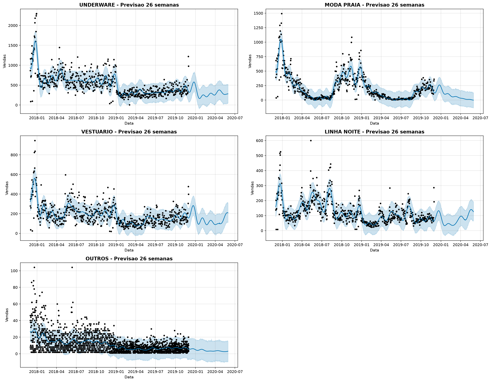

# Modelo de Previsao (Prophet)

## Resumo

| Metrica | Valor |
|---------|-------|
| Fonte | `fato_estoque_diario.qtd_venda` |
| Periodo historico | 2017-12-01 a 2019-11-30 |
| Registros | 619,289 vendas (qtd_venda > 0) |
| Lojas | 11 |
| Categorias | 9 (agrupadas em 5 modelos) |
| Modelos treinados | 5 (1 por categoria) |
| Horizonte | 26 semanas (182 dias) |
| Feriados | BR (11 feriados nacionais) |
| Sazonalidade | Anual (multiplicativa) |

## Previsao por Categoria (26 semanas)

| Categoria | Previsao Total | Media Diaria | Pico Max | Data do Pico |
|-----------|---------------|--------------|----------|--------------|
| UNDERWARE |    55,862 |    306.9 |   579 | 2019-12-25 |
| MODA PRAIA |    15,035 |     82.6 |   261 | 2019-12-25 |
| VESTUARIO |    26,125 |    143.5 |   283 | 2019-12-22 |
| LINHA NOITE |    14,247 |     78.3 |   141 | 2020-05-19 |
| OUTROS |       715 |      3.9 |     6 | 2019-12-20 |

## Componentes Sazonais

### UNDERWARE

**Meses por impacto sazonal (vs media anual)**
- Dezembro: +38%
- Novembro: +31%
- Outubro: +12%
- Setembro: +7%
- Abril: +4%
- Agosto: -2%
- Julho: -5%
- Junho: -10%
- Maio: -13%
- Marco: -16%
- Janeiro: -22%
- Fevereiro: -29%

### MODA PRAIA

**Meses por impacto sazonal (vs media anual)**
- Novembro: +121%
- Dezembro: +110%
- Outubro: +88%
- Janeiro: +53%
- Setembro: +37%
- Fevereiro: -2%
- Marco: -29%
- Agosto: -61%
- Abril: -65%
- Julho: -84%
- Maio: -87%
- Junho: -89%

### VESTUARIO

**Meses por impacto sazonal (vs media anual)**
- Dezembro: +53%
- Novembro: +25%
- Outubro: +14%
- Junho: +14%
- Maio: +4%
- Julho: -0%
- Setembro: -1%
- Agosto: -3%
- Janeiro: -16%
- Fevereiro: -25%
- Marco: -27%
- Abril: -40%

### LINHA NOITE

**Meses por impacto sazonal (vs media anual)**
- Agosto: +56%
- Maio: +42%
- Dezembro: +27%
- Junho: +27%
- Julho: +15%
- Abril: -5%
- Novembro: -6%
- Outubro: -15%
- Setembro: -24%
- Marco: -27%
- Janeiro: -43%
- Fevereiro: -53%

### OUTROS

**Meses por impacto sazonal (vs media anual)**
- Novembro: +33%
- Outubro: +25%
- Setembro: +19%
- Agosto: +16%
- Dezembro: +12%
- Junho: +2%
- Janeiro: -5%
- Julho: -10%
- Fevereiro: -17%
- Abril: -17%
- Marco: -28%
- Maio: -32%

## Recomendacao de Compra (120 dias de cobertura)

Considerando a sazonalidade, segue a quantidade estimada de venda para 120 dias por categoria:

| Categoria | Previsao 120d (unid) | Estoque Recomendado (unid) |
|-----------|---------------------|--------------------------|
| UNDERWARE |     36,811 |     44,172 |
| MODA PRAIA |     14,041 |     16,848 |
| VESTUARIO |     17,998 |     21,597 |
| LINHA NOITE |      7,837 |      9,404 |
| OUTROS |        524 |        628 |
| **TOTAL** | | **92,649** |

*Estoque recomendado inclui margem de seguranca de 20% sobre a previsao.*

## Graficos

