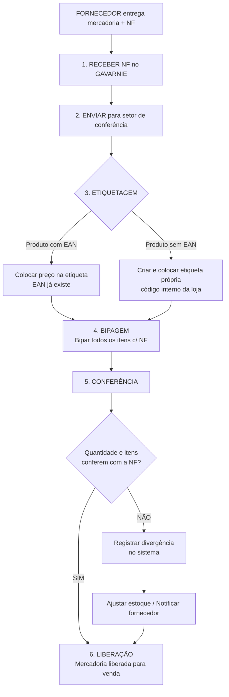
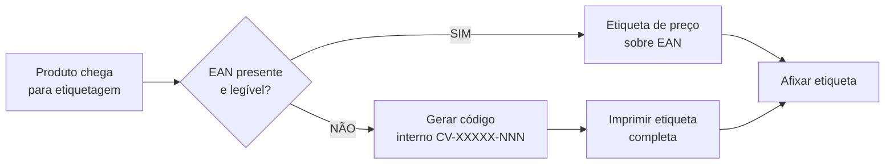
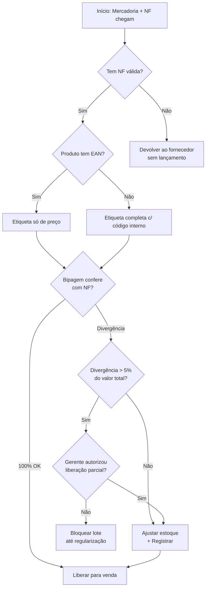

# Processo de Entrada de Mercadorias

## Chez Violeta — Joias e Acessórios

---

## 1. Objetivo

Documentar o fluxo de recebimento de mercadorias na loja Chez Violeta, desde a recepção da Nota Fiscal (NF) do fornecedor até a liberação do produto para venda. Este documento serve como referência para treinamento de novos colaboradores, padronização operacional e base para futuras automações e dashboards de monitoramento.

**Público-alvo:** Conferentes, gerentes de loja, equipe de estoque, equipe de TI/sistemas.

---

## 2. Visão Geral do Processo

```
┌─────────────────────────────────────────────────────────────────────────┐
│                 PROCESSO DE ENTRADA DE MERCADORIAS                      │
│                         Chez Violeta                                    │
│                                                                         │
│   FORNECEDOR ──► 1. RECEBER NF  ──► 2. ENVIAR P/ CONFERÊNCIA          │
│                        │                    │                           │
│                        ▼                    ▼                           │
│                  ┌──────────────────────────────┐                       │
│                  │     3. ETIQUETAGEM           │                       │
│                  │   ┌──────┴──────┐            │                       │
│                  │   │             │            │                       │
│                  │   ▼             ▼            │                       │
│                  │ EAN        CÓDIGO PRÓPRIO    │                       │
│                  │ (colocar    (colocar         │                       │
│                  │  preço)     etiqueta própria)│                       │
│                  └──────┬──────────────┬────────┘                       │
│                         │              │                                │
│                         ▼              ▼                                │
│                  ┌──────────────────────────────┐                       │
│                  │     4. BIPAGEM               │                       │
│                  │  (conferir c/ NF)            │                       │
│                  └──────────────┬───────────────┘                       │
│                                 │                                       │
│                                 ▼                                       │
│                  ┌──────────────────────────────┐                       │
│                  │     5. CONFERÊNCIA           │                       │
│                  │  Qtd + itens batem?          │                       │
│                  │  ┌──────┴──────┐             │                       │
│                  │  │             │             │                       │
│                  │ SIM           NÃO            │                       │
│                  └──────┬──────────┴────────────┘                       │
│                         │           │                                   │
│                         │           ▼                                   │
│                         │     Divergência:                              │
│                         │     Registrar + Ajustar                       │
│                         │           │                                   │
│                         ▼           ▼                                   │
│                  ┌──────────────────────────────┐                       │
│                  │     6. LIBERAÇÃO             │                       │
│                  │  Mercadoria disponível       │                       │
│                  │  para venda                  │                       │
│                  └──────────────────────────────┘                       │
└─────────────────────────────────────────────────────────────────────────┘
```

### Diagrama Mermaid



---

## 3. Etapas Detalhadas

### Etapa 1 — Recebimento da Nota Fiscal (NF)

**Responsável:** Administrativo / Recepção de mercadorias
**Sistema:** GAVARNIE Oracle ERP
**Tempo estimado:** 5–10 minutos

**Descrição:**
A Nota Fiscal eletrônica (NF-e) é recebida junto com a mercadoria entregue pelo fornecedor ou transportadora. O colaborador deve:

1. **Conferir dados básicos da NF:**
   - Razão social / CNPJ do fornecedor confere com o pedido?
   - Número da NF é legível e válido?
   - Data de emissão é recente (≤ 30 dias)?
2. **Lançar entrada no GAVARNIE:**
   - Acessar o módulo de entrada de NF no GAVARNIE Oracle
   - Registrar a NF no sistema — número, série, fornecedor, valor total
   - Vincular ao pedido de compra correspondente (se houver)
3. **Imprimir protocolo de recebimento** (se aplicável)

**Regras de negócio:**
- NF sem pedido de compra vinculado deve ser sinalizada ao gerente antes do lançamento
- NF com valor acima de R$ 10.000 requer autorização do gerente para lançamento
- Fornecedores não cadastrados no GAVARNIE devem ser cadastrados antes do lançamento

**Controles:**
- Sistema valida CNPJ do fornecedor contra cadastro
- Sistema impede lançamento de NF duplicada (mesmo número + mesma série + mesmo fornecedor)

---

### Etapa 2 — Envio para Conferência

**Responsável:** Administrativo / Auxiliar de estoque
**Sistema:** Físico (ticket / planilha de encaminhamento)
**Tempo estimado:** 2–5 minutos

**Descrição:**
Após o lançamento da NF no sistema, a mercadoria física é encaminhada ao setor de conferência junto com:

- Cópia impressa da NF (ou código do lançamento)
- Planilha de encaminhamento (opcional, para lotes grandes)

**Regras de negócio:**
- Mercadoria frágil (joias, peças delicadas) deve ser transportada em bandejas acolchoadas
- Lotes acima de 50 itens devem ser subdivididos em caixas identificadas (Caixa 1/3, 2/3, 3/3)

---

### Etapa 3 — Etiquetagem

**Responsável:** Conferente / Estoquista
**Tempo estimado:** 1–3 minutos por item

**Descrição:**
Cada item recebe identificação antes da bipagem. O fluxo se divide em dois caminhos:

#### 3A. Produto com Código EAN (barras padrão)

**Quando:** O produto já possui código de barras EAN-13 fornecido pelo fabricante.

**Ações:**
1. Verificar se o EAN está legível na embalagem
2. **Colocar etiqueta de preço** sobre ou ao lado do EAN (conforme política da loja)
3. A etiqueta de preço deve conter: valor de venda, código do produto (se houver), data de precificação
4. Registrar no sistema que o item foi etiquetado (se o fluxo exigir)

#### 3B. Produto com Código Próprio (sem EAN)

**Quando:** Joias sem código de barras padrão, acessórios artesanais, produtos com embalagem própria da Chez Violeta.

**Ações:**
1. **Gerar etiqueta interna** no sistema GAVARNIE (código interno da loja)
   - Formato do código: CV-XXXXX-NNN (CV = Chez Violeta, XXXXX = categoria, NNN = sequencial)
2. **Imprimir etiqueta** com:
   - Código de barras interno (Code 128 ou similar)
   - Nome do produto
   - Preço de venda
   - QR Code opcional com link para ficha do produto
3. **Afixar etiqueta** na embalagem ou no lacre de segurança (para joias)
4. Registrar a etiqueta como ativa no inventário

**Critérios para código próprio:**
- Joias sem embalagem original do fabricante → **código próprio**
- Acessórios artesanais (sem fornecedor padronizado) → **código próprio**
- Produtos com EAN danificado/ilegível → **código próprio** (após tentativa de obter novo EAN)
- Qualquer produto com EAN válido → **EAN**



---

### Etapa 4 — Bipagem (Scan)

**Responsável:** Conferente
**Sistema:** Coletor / bipador (leitor de código de barras)
**Tempo estimado:** 10–30 segundos por item (lote médio: 15–30 min para 50 itens)

**Descrição:**
Todos os itens são bipados (scanheados) individualmente, confrontando com a NF lançada no sistema.

**Procedimento:**
1. **Abrir a conferência no coletor** vinculada à NF recebida
2. **Bipar cada item** — o sistema registra automaticamente:
   - Código do produto (EAN ou interno)
   - Quantidade bipada
   - Timestamp da bipagem
3. **Conferência visual rápida** durante a bipagem:
   - Produto corresponde à descrição da NF?
   - Embalagem em boas condições?
   - Quantidade bipada = quantidade física?

**Controles:**
- Sistema impede bipar o mesmo código duas vezes consecutivas sem confirmação (anti-duplicidade)
- Se o código bipado não consta na NF, o sistema emite alerta sonoro/sinalização
- Itens com defeito visível devem ser separados e marcados como "avariado" no sistema

**Exceções:**
- **Item avariado:** Não bipar; separar em lote de devolução; registrar NF de devolução
- **Item em falta na embalagem:** Bipar quantidade real; sistema aponta divergência
- **Item excedente (NF não lista):** Sinalizar; aguardar decisão do gerente (incorporar ou devolver)

---

### Etapa 5 — Conferência Final

**Responsável:** Conferente Sênior / Supervisor
**Sistema:** GAVARNIE Oracle + Coletor
**Tempo estimado:** 5–15 minutos (dependente do tamanho do lote)

**Descrição:**
Após a bipagem de todos os itens, o sistema executa a conferência automática entre:

- **Esperado:** O que consta na NF lançada (quantidade x item)
- **Real:** O que foi bipado (quantidade x item)

**Resultados possíveis:**

| Resultado | Ação |
|-----------|------|
| **Conferência 100% OK** | Avançar para Liberação |
| **Divergência de quantidade** | Registrar divergência; recontar fisicamente; se confirmado, ajustar estoque no sistema |
| **Item não localizado** | Marcar como "pendente" no sistema; busca adicional de 24h; se não encontrado, registrar perda |
| **Item excedente** | Se for do mesmo fornecedor: incorporar com ajuste de NF. Se não: segregar e notificar fornecedor |

**Regras de negócio:**
- Divergência > 5% do valor total da NF requer autorização do gerente para liberação parcial
- Itens de alto valor (joias > R$ 500) têm conferência obrigatória por dois conferentes (dupla checagem)
- Divergências devem ser registradas em relatório próprio (físico ou digital) com fotos (se aplicável)

---

### Etapa 6 — Liberação para Venda

**Responsável:** Gerente de loja / Supervisor de estoque
**Sistema:** GAVARNIE Oracle
**Tempo estimado:** 2–5 minutos

**Descrição:**
Finalizada a conferência (com ou sem divergências resolvidas), a mercadoria é liberada:

1. **No sistema GAVARNIE:** Alterar status do lote de "Em conferência" para "Liberado"
2. **Estoque físico:** Mercadoria é movida da área de conferência para:
   - Exposição (vitrine / balcão) — produtos de pronta entrega
   - Estoque interno / retaguarda — produtos para reposição
3. **Atualização de inventário:** Quantidades disponíveis para venda são atualizadas no sistema

**Regras de negócio:**
- Produtos liberados entram imediatamente no estoque disponível para venda (online e físico)
- Joias de alto valor (> R$ 5.000) devem ser liberadas com dupla assinatura (conferente + gerente)
- Lotes com divergência resolvida liberam apenas os itens conferidos; itens pendentes ficam bloqueados

---

## 4. Decisões e Ramificações

### Árvore de Decisão Principal



---

## 5. Papéis e Responsabilidades

| Papel | Etapas | Responsabilidades |
|-------|--------|-------------------|
| **Administrativo** | 1, 2 | Lançar NF no GAVARNIE, encaminhar mercadoria |
| **Conferente** | 3, 4, 5 | Etiquetar, bipar, conferir, sinalizar divergências |
| **Conferente Sênior** | 5 | Validar divergências, dupla checagem de itens de alto valor |
| **Supervisor de Estoque** | 5, 6 | Autorizar liberações parciais, gerenciar bloqueios |
| **Gerente de Loja** | 1, 5, 6 | Autorizar NF acima do limite, resolver divergências críticas, liberar lote |

---

## 6. Sistemas Envolvidos

| Sistema | Função | Tipo |
|---------|--------|------|
| **GAVARNIE Oracle ERP** | Lançamento de NF, controle de estoque, liberação | Legado (Oracle) |
| **Coletor / Bipador** | Leitura de códigos de barras (EAN e interno) | Hardware + software embarcado |
| **Sistema de Etiquetas** | Geração e impressão de etiquetas internas | Integrado ao GAVARNIE |
| **Planilha de Encaminhamento** | Controle físico de lotes grandes | Opcional / manual |

---

## 7. Regras de Negócio Consolidadas

| # | Regra | Severidade |
|---|-------|------------|
| 1 | NF sem pedido de compra deve ser sinalizada ao gerente | Média |
| 2 | NF > R$ 10.000 requer autorização do gerente para lançamento | Alta |
| 3 | Sistema impede NF duplicada (mesmo nº + série + fornecedor) | Alta |
| 4 | Joias e itens frágeis transportados em bandejas acolchoadas | Média |
| 5 | Lotes > 50 itens subdivididos em caixas identificadas | Baixa |
| 6 | Joias sem embalagem original → código próprio (não EAN) | Alta |
| 7 | Sistema alerta se código bipado não consta na NF | Alta |
| 8 | Divergência > 5% do valor total → autorização do gerente | Alta |
| 9 | Itens > R$ 500 requerem dupla checagem de conferência | Alta |
| 10 | Joias > R$ 5.000 requerem dupla assinatura na liberação | Alta |

---

## 8. SLAs e Tempos Esperados

| Etapa | Tempo Estimado | SLA Máximo | Observação |
|-------|---------------|------------|------------|
| 1. Receber NF | 5–10 min | 30 min | Urgência: mercadoria aguardando |
| 2. Enviar para conferência | 2–5 min | 15 min | Imediato após lançamento |
| 3. Etiquetagem (por item) | 1–3 min | 5 min/item | Varia conforme complexidade |
| 4. Bipagem (lote de 50 itens) | 15–30 min | 45 min | Inclui conferência visual |
| 5. Conferência final | 5–15 min | 30 min | Dependente do volume de divergências |
| 6. Liberação | 2–5 min | 10 min | Após conferência OK |
| **TOTAL (lote médio 50 itens)** | **40–80 min** | **~2h** | Sem divergências graves |

---

## 9. Controles de Qualidade

### Checkpoints Obrigatórios

- [ ] **Checkpoint 1 (pós-etapa 1):** NF lançada no GAVARNIE sem erros de digitação
- [ ] **Checkpoint 2 (pós-etapa 3):** Todos os itens etiquetados (preço ou etiqueta própria)
- [ ] **Checkpoint 3 (pós-etapa 4):** Todos os itens bipados; nenhum item pulado
- [ ] **Checkpoint 4 (pós-etapa 5):** Divergências registradas e endereçadas
- [ ] **Checkpoint 5 (pós-etapa 6):** Estoque atualizado no GAVARNIE

### Indicadores de Qualidade (KPI)

| Indicador | Fórmula | Meta |
|-----------|---------|------|
| Tempo médio de conferência | Soma dos tempos / nº de lotes | ≤ 2h por lote |
| Taxa de divergência | Lotes c/ divergência / Total de lotes | ≤ 5% |
| Erros de etiquetagem | Itens com etiqueta incorreta / Total etiquetado | ≤ 1% |
| Acurácia de bipagem | Itens bipados corretamente / Total bipado | ≥ 99,5% |
| Tempo até liberação | NF → Liberação | ≤ 4h úteis |

---

## 10. Fluxo de Exceções

### 10.1 Devolução ao Fornecedor

```
Item avariado / em desacordo → Separar fisicamente
                           → Registrar NF de devolução no GAVARNIE
                           → Notificar fornecedor (e-mail / sistema)
                           → Aguardar instruções de coleta
                           → Baixar do inventário após coleta
```

### 10.2 Perda / Extravio

```
Item não localizado na conferência → Busca por 24h
                                  → Se não encontrado: registrar perda
                                  → Ajustar inventário
                                  → Notificar segurança (se aplicável)
                                  → Registrar ocorrência (se valor > R$ 1.000)
```

### 10.3 Incorporação de Excedente

```
Item excedente do mesmo fornecedor → Gerente autoriza?
                                  → Sim: Fornecedor emite NF complementar
                                  → Não: Segregar para devolução
                                  → Enquanto isso: item fica bloqueado
```

---

## 11. Glossário

| Termo | Definição |
|-------|-----------|
| **NF / NF-e** | Nota Fiscal eletrônica — documento fiscal digital |
| **EAN** | European Article Number — código de barras padrão internacional (13 dígitos) |
| **Código próprio** | Código de barras interno gerado pela Chez Violeta (formato CV-XXXXX-NNN) |
| **Bipagem** | Ato de scanear o código de barras com o coletor |
| **GAVARNIE** | Sistema ERP legado da Oracle utilizado pela Chez Violeta |
| **Conferência** | Processo de verificação se quantidade e itens correspondem à NF |
| **Divergência** | Diferença entre o que foi pedido/NF e o que foi recebido fisicamente |
| **Liberação** | Autorização final para que a mercadoria fique disponível para venda |

---

## 12. Histórico de Revisões

| Versão | Data | Autor | Alterações |
|--------|------|-------|------------|
| 1.0 | 2026-07-08 | dashboard-designer (LAOS) | Documento inicial |

---

*Este documento foi produzido como artefato de design do projeto Chez Violeta Intelligence, seguindo as diretrizes de documentação de processos da LAOS. Para dúvidas ou sugestões, contatar o gerente de operações da loja.*
